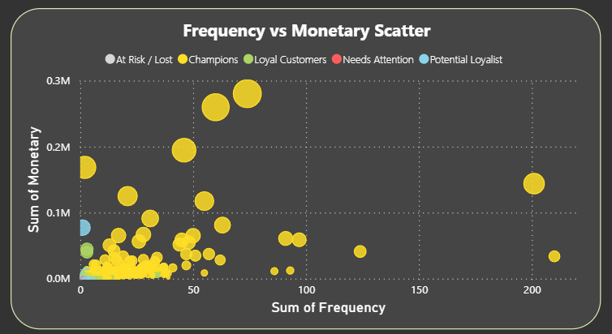

# Customer Segmentation & RFM Analysis (Python + Power BI)

This project focuses on **customer segmentation using RFM (Recency, Frequency, Monetary)** analysis,  
and demonstrates how to translate raw transaction data into **business insights** using **Python** and **Power BI**.

---

## Project Overview

**Objective:**  
To group customers based on their purchasing behavior and identify key segments for marketing and retention strategies.

**Dataset:**  
[Online Retail II Dataset (Kaggle)](https://www.kaggle.com/datasets)  
Columns used: `InvoiceNo`, `StockCode`, `Description`, `Quantity`, `InvoiceDate`, `UnitPrice`, `CustomerID`, `Country`

**Techniques Used:**
- RFM Scoring (Recency–Frequency–Monetary)
- K-Means ready segmentation logic
- Business-oriented visualization in Power BI
- Pareto (80/20) revenue analysis

**Tools & Libraries:**
- `Python (Pandas, NumPy)`
- `Power BI`
- `Excel / CSV integration`

---

## Data Preparation (Python)

RFM metrics were computed using Python before loading into Power BI.

```python
# Calculate RFM scores
rfm = data.groupby('CustomerID').agg({
    'InvoiceDate': lambda x: (latest_date - x.max()).days,  # Recency
    'InvoiceNo': 'count',                                   # Frequency
    'TotalPrice': 'sum'                                     # Monetary
}).reset_index()

rfm.columns = ['CustomerID', 'Recency', 'Frequency', 'Monetary']
```
## RFM Table Export

The resulting RFM table was exported as:
data/rfm_table.csv

💬 **Note:** This CSV file was later used in **Power BI** for segmentation and visualization.

---

## Power BI Dashboard

The Power BI dashboard was built using the exported RFM dataset.  
It combines multiple perspectives of **customer value** and **behavior**.

---

### Dashboard Sections

| Analysis | Visual Type | Insight |
|-----------|--------------|----------|
| **Customer Distribution** | Bar chart | Segment size comparison |
| **Monetary by Segment** | Pie chart | Share of revenue by group |
| **Frequency vs Monetary** | Scatter chart | Shopping frequency vs spending |
| **Revenue Concentration (Pareto)** | Line chart | 80/20 rule: few customers drive most revenue |
| **Frequency vs Recency** | Scatter chart | Customer activity vs loyalty |
| **Segment Profitability Matrix** | Combo chart | Customer count vs total revenue |
| **KPI Summary** | Card visuals | Total revenue, total customers, average spend |

---

## Dashboard Preview

Below is a screenshot of the final Power BI dashboard:



Each color represents a customer segment:

- 🟡 **Champions** — Highly active, top spenders  
- 🟢 **Loyal Customers** — Repeat buyers with consistent contribution  
- 🔵 **Potential Loyalist** — Early-stage repeat customers  
- 🔴 **Needs Attention** — Declining engagement  
- ⚫ **At Risk / Lost** — Inactive or churned

---

## Key Insights

- **76% of total revenue** comes from **Champions**, confirming the Pareto principle.  
- **Loyal Customers** represent **13%** of the customer base but sustain long-term revenue flow.  
- **Potential Loyalists** and **Needs Attention** segments highlight upselling opportunities.  
- **At Risk** customers are few but previously high-value — ideal for re-engagement campaigns.  

---

## Project Architecture
```bash
📁 customer-segmentation-RFM-project/
│
├── data/
│   ├── Online Retail Data Set.xlsx
│   ├── rfm_table.csv
│
├── notebooks/
│   └── rfm_analysis.ipynb
│
├── powerbi/
│   └── Customer_Segmentation_Dashboard.pbix
│
└── README.md
```
## 🚀 How to Run

1. Clone this repository

git clone
```bash
https://github.com/Harun-Bilge/Customer-Segmentation-RFM-Project.git
```
2. Install dependencies
pip install pandas numpy

3. Generate the RFM table

Run the Jupyter notebook (rfm_analysis.ipynb) or the .py script to create the processed RFM dataset.

4. Visualize in Power BI

Open the Power BI file (Customer_Segmentation_Dashboard.pbix)
and connect it to the exported dataset:

data/rfm_table.csv

---

## Future Work

- Add time-series analysis (New vs Returning Customers) using full transaction history  
- Apply K-Means clustering on RFM metrics for more dynamic segmentation  
- Integrate profit margin data for profitability-based targeting  
- Automate pipeline with Power BI Gateway for scheduled updates  

---

## Author

**Harun Bilge**  
Data Analyst | Python | SQL | Power BI  
📍 *Istanbul, Türkiye*  

🔗 [LinkedIn](https://www.linkedin.com/in/harun-bilge)  
🔗 [GitHub](https://github.com/Harun-Bilge)

